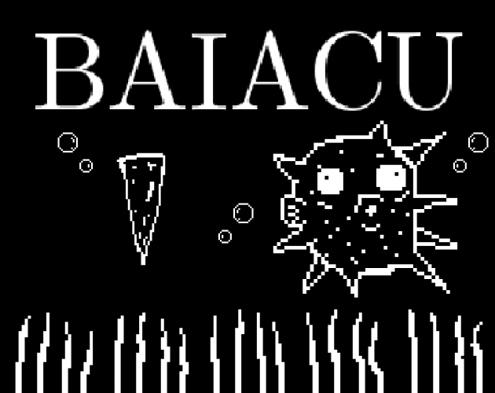

# Baiacu
Game made with [Godot](https://godotengine.org/) for the [Go Godot Jam](https://itch.io/jam/go-godot-jam).

Baiacu is available for download and can be played directly in your browser here: https://gilzoide.itch.io/baiacu

## Credits
- All [textures/baiacu/*](textures/baiacu) assets by Elsenyh. All rights reserved.
- [Pinch icon](textures/PinchIcon.svg) and [Mouse icon](textures/MouseMiddleButtonIcon.svg) from Material Design Icons: https://github.com/Templarian/MaterialDesign
- **Godot-Touch-Input-Manager** scripts by Federico Ciuffardi: https://github.com/Federico-Ciuffardi
- **Symbola** font by George Douros: https://fontlibrary.org/en/font/symbola

## License
First party source code is released to the public domain available under [The Unlicense](UNLICENSE).

All audio assets under [sounds](sounds) folder and [Arrow icon](textures/MouseWheelArrowIcon.svg)
are available under [Creative Commons BY-SA 4.0](https://creativecommons.org/licenses/by-sa/4.0/).
